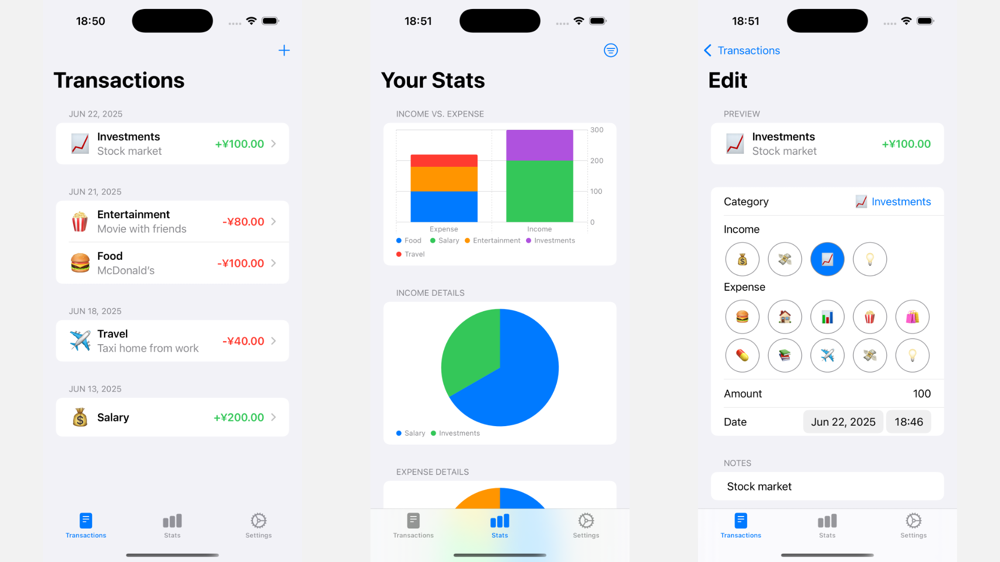

# Spently: Spending tracker for iOS

Spently is an income and spending tracker for iOS / iPadOS. You can input your transactions, sort them into categories, and view detailed reports.

## Installation

[Join TestFlight now to try the app!](http://testflight.apple.com/join/ANC8gK4G)

## Description

Supercharge your money by tracking every transaction and viewing statistics about them!

Features:
- Track each income and expense transaction
- View graphs and reports about your transactions
- Organize transactions into customizable categories
- Seamless integration with Shortcuts to create workflows
- And more!

## Technical Stuff

This app uses the Swift Data framework to store your transactions. Each transaction and each category is a model in Swift Data.

To display the charts on the Stats page, Swift Charts is used. It's actually super easy to use :-)

`@AppStorage` (aka UserDefaults) was used to store small amounts of data (such as the chosen currency).

The app also adopts the App Intents framework for integration with the Shortcuts app. You can create shortcuts that search for transactions and categories and add transactions. More actions are coming soon!

## Contributing

Contributions are welcome! Please [open an issue](https://github.com/david-why/Spently/issues) if you find a bug, or [open a pull request](https://github.com/david-why/Spently/pulls) if you'd like to have a try on fixing it yourself. I'll review those when I have time!

## AI Disclaimer

Some small portions of code were generated by Xcode's Predictive Code Completion Model, but only limited to code less than one line.

The icon is generated by Google Gemini.

  

